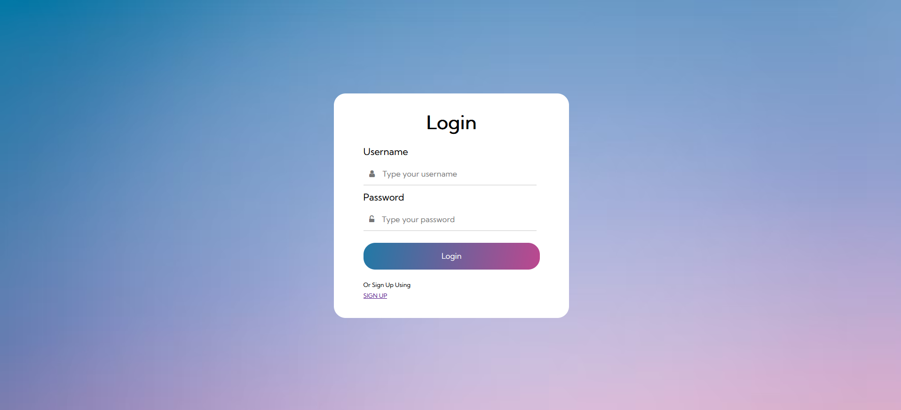

<h1 align="center"> Simple Login page </h1>

A simple front end login page for a future exam

  <a href="#-tecnologias">Tecnologias</a>&nbsp;&nbsp;&nbsp;|&nbsp;&nbsp;&nbsp;
  <a href="#-projeto">Projeto</a>&nbsp;&nbsp;&nbsp;|&nbsp;&nbsp;&nbsp;
  <a href="#deploy">Deploy</a>&nbsp;&nbsp;&nbsp;|&nbsp;&nbsp;&nbsp;
  <a href="#-licença">Licença</a>

 

## 🚀 Tecnologias

Esse projeto foi desenvolvido com as seguintes tecnologias:

- HTML e CSS
- Git e Github

## 💻 Projeto

pagina de Login

## Deploy 
✅ [Github](https://leanddo.github.io/Log-in-page/)

## ⚖ Licença

Esse projeto está sob a licença MIT.

Feito por Leandro Amaral 🦊